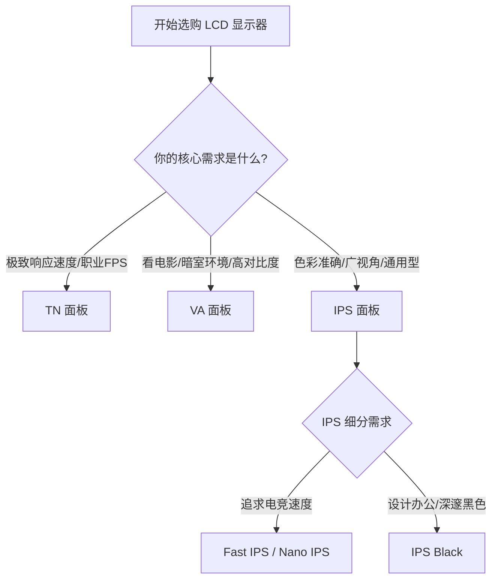

# 面板技术解析

## LCD 家族: TN, VA, IPS

液晶显示器 (LCD) 需要背光层发光,液晶层控制光线通过。根据液晶排列方式不同,主要分为三大类。

### 1. TN (Twisted Nematic)
*   **关键词**:**极速**、**泛白**。
*   **优点**:
    *   响应时间极快(原生可达 1ms 以下)。
    *   刷新率极高(早期的 240Hz+ 都是 TN)。
    *   成本低廉。
*   **缺点**:
    *   **可视角度极差**:稍微偏一点看就变色。
    *   **色彩表现差**:对比度低,颜色泛白,覆盖色域窄。
*   **适用人群**:职业 FPS 电竞选手(CS:GO, Valorant)。普通玩家不推荐。

### 2. VA (Vertical Alignment)
*   **关键词**:**高对比度**、**曲面**、**拖影**。
*   **优点**:
    *   **对比度高**:静态对比度通常在 3000:1 以上,黑色深邃,适合看电影。
    *   **漏光控制好**:不像 IPS 容易漏光。
    *   **容易做成曲面**。
*   **缺点**:
    *   **响应时间慢**:这是致命伤,容易产生"黑抹布"效应(暗部场景移动时的严重拖影)。*注:三星高端 Odyssey 系列使用的 Fast VA 技术已基本解决此问题。*
    *   **可视角度一般**:侧看会泛白(Gamma Shift)。
*   **适用人群**:影音爱好者、单机大作玩家、习惯曲面屏的用户。

### 3. IPS (In-Plane Switching)
*   **关键词**:**色彩准**、**可视角度好**、**漏光**。
*   **优点**:
    *   **色彩表现最佳**:色准高,色域广。
    *   **可视角度优秀**:任意角度看都不偏色。
    *   **响应速度均衡**:现在的 Fast IPS / Nano IPS 响应时间已能做到 1ms GtG,仅仅略逊于 TN。
*   **缺点**:
    *   **对比度低**:通常只有 1000:1,黑色不够黑,暗室观看显得发灰。
    *   **IPS Glow**:黑色背景下的辉光现象。
    *   **漏光**:品控不好的屏幕边缘会有漏光。
*   **适用人群**:设计师、摄影师、绝大多数游戏玩家、办公用户。**IPS 是目前最万金油的选择**。

#### IPS 的子分类
*   **Fast IPS / Rapid IPS**:友达光电等厂商推出,显著提升了响应速度,适合电竞。
*   **Nano IPS**:LG 推出,在背光层加入纳米粒子吸收多余光波,色域极广(DCI-P3 98%),但对比度略低(800:1 左右)。
*   **IPS Black**:LG 最新技术,将对比度提升至 2000:1,大幅改善了黑色表现。

### 面板选择决策图

### 总结对比表

| 特性 | TN | VA | IPS |
| :--- | :--- | :--- | :--- |
| **响应速度** | ⭐⭐⭐⭐⭐ | ⭐⭐ | ⭐⭐⭐⭐ |
| **可视角度** | ⭐ | ⭐⭐⭐ | ⭐⭐⭐⭐⭐ |
| **色彩表现** | ⭐⭐ | ⭐⭐⭐⭐ | ⭐⭐⭐⭐⭐ |
| **对比度** | ⭐⭐ | ⭐⭐⭐⭐⭐ | ⭐⭐⭐ |
| **推荐用途** | 职业电竞 | 影音、单机游戏 | 设计、通用电竞、办公 |

---

## OLED 技术: WOLED, QD-OLED

OLED (Organic Light-Emitting Diode) 即有机发光二极管。与 LCD 不同,OLED **不需要背光**,每个像素点都是**自发光**的。

### 核心优势

1.  **无限对比度**:像素可以完全关闭,显示出**纯粹的黑**。这让画面具有极强的通透感和立体感。
2.  **极速响应**:响应时间通常 < 0.03ms,比最快的 LCD 还要快几十倍。动态清晰度无敌。
3.  **超薄机身**:没有背光模组,屏幕可以做得像纸一样薄,甚至可弯曲。

### 核心劣势

1.  **烧屏 (Burn-in) 风险**:有机材料会随发光时间衰减。如果长时间显示固定画面(如任务栏、血条),该区域像素老化不均匀,会留下永久残影。
2.  **全屏亮度受限 (ABL)**:为了保护面板和控制功耗,当显示大面积白色时,OLED 会强制降低亮度。

### 主流技术分支

#### 1. WOLED (White OLED)
*   **厂商**:LG Display 主导。
*   **原理**:垂直堆叠发光。使用白色 OLED 光源,通过彩色滤光片(红绿蓝白 CF)产生颜色。也就是 WRGB 排列。
*   **特点**:
    *   技术成熟,产能大,主要用于电视和部分显示器。
    *   白色子像素有助于提升亮度,但在高亮下色彩纯度会下降(白光冲淡了颜色)。
    *   **文字显示**:由于特殊的 WRGB 子像素排列,在 Windows 下显示文字边缘可能会有彩边(锯齿感),不如标准 RGB 排列清晰。

#### 2. QD-OLED (Quantum Dot OLED)
*   **厂商**:Samsung Display 主导。
*   **原理**:使用蓝色 OLED 作为光源,激发上面的**量子点 (Quantum Dot)** 层产生红光和绿光。
*   **特点**:
    *   **色彩更纯**:量子点转换效率高,色域覆盖极广(DCI-P3 可达 99.3%),色彩亮度(Color Volume)比 WOLED 更高。
    *   **可视角度更好**。
    *   **文字显示**:三角形(Triangle)子像素排列,文字边缘依然有彩边问题,但比早期 WOLED 略好。
    *   **抗光性**:面板表面没有偏光片,环境光强时黑色会发紫。

### 选购建议

*   **纯游戏/影音**:OLED 是目前的画质天花板。如果你追求极致的 HDR 效果和动态清晰度,且预算充足,买它。
*   **办公/代码**:**慎重**。
    1.  静态的菜单栏和窗口容易导致烧屏。
    2.  特殊的子像素排列导致文字不够锐利。
    3.  ABL 机制在浏览大面积白色网页时忽亮忽暗,体验不佳。

---

## 背光革命: Mini-LED

Mini-LED 并不是一种全新的面板(像 OLED 那样),而是一种**背光技术**的进化。它本质上依然是 LCD 屏幕(通常是 IPS 或 VA 面板),但背光层发生了巨变。

### 原理:分区背光 (Local Dimming)

传统 LCD 是一整块背光板,要么全亮,要么全暗。
Mini-LED 将背光灯珠做得非常小(Mini),并在屏幕后方铺满成千上万颗。这些灯珠被划分为几百甚至几千个**独立控制的区域 (Zones)**。

*   **亮的地方亮**:显示太阳时,对应区域灯珠全开,亮度激增(可达 1000-2000 nits)。
*   **暗的地方暗**:显示夜空时,对应区域灯珠关闭,接近 OLED 的纯黑。

### 优势

1.  **高亮度**:轻松突破 1000 nits,远超 OLED。在明亮环境下观看 HDR 内容更有爆发力。
2.  **高对比度**:虽然不如 OLED 的像素级控光,但比传统 LCD 强太多,接近 OLED 的视觉体验。
3.  **无烧屏风险**:本质是无机 LED 和 LCD,寿命长,适合高强度使用(如作为生产力工具)。

### 劣势

1.  **光晕效应 (Blooming)**:这是 Mini-LED 最大的痛点。当在黑色背景上显示明亮的小物体(如星空、鼠标指针、字幕)时,由于背光分区不够小,点亮的区域会溢出到黑色背景,物体周围会出现一圈"光晕"。
    *   分区越多,光晕越弱。
2.  **厚度和发热**:背光模组复杂,显示器通常较厚且发热量大。
3.  **可视角度影响**:侧看时光晕现象会加剧。

### 分区数量的重要性

分区数量直接决定了控光精度。
*   **384 分区**:入门级。光晕较明显,体验一般。
*   **576 - 1152 分区**:主流级。光晕控制尚可,27寸显示器的甜点区。
*   **2000+ 分区**:高端级。光晕很难察觉,画质极佳。

### Mini-LED vs OLED

*   **选 Mini-LED**:如果你经常办公、长时间显示静态画面、在明亮房间使用,或者担心烧屏。它是兼顾 HDR 娱乐和日常工作的最佳全能方案。
*   **选 OLED**:如果你主要在暗室玩游戏、看电影,追求极致的暗部细节和零光晕,且不介意烧屏风险。

---

## 未来显示: Micro-LED

Micro-LED 被认为是显示技术的终极形态。

### 什么是 Micro-LED?

不要把它和 Mini-LED 搞混。
*   **Mini-LED** = LCD + 改良背光。
*   **Micro-LED** = 自发光技术(像 OLED)。

Micro-LED 将 LED 灯珠微缩到微米级别,**每一个像素点**都是由独立的红、绿、蓝微型 LED 组成。

### 完美的结合体

它结合了 OLED 和 LCD 的所有优点,并摒弃了它们的缺点:

1.  **像 OLED 一样**:像素级自发光,无限对比度,极速响应,无光晕。
2.  **像 LCD 一样**:采用无机材料(Inorganic),**寿命极长**,**不会烧屏**。
3.  **超越两者**:
    *   **亮度**:可以轻松达到数千甚至上万尼特。
    *   **能效**:比 OLED 更省电。
    *   **色域**:极广。

### 为什么还没普及?

**巨量转移 (Mass Transfer)** 技术太难了。
在一块 4K 屏幕上,有 $3840 \times 2160 \times 3 \approx 2500$ 万个子像素。将这 2500 万颗微米级的 LED 芯片精确地转移到基板上,良率低、成本极高。

### 现状

目前 Micro-LED 仅应用于:
*   **超大尺寸商用墙**(如 Samsung The Wall),价格都在百万元级别。
*   **超小尺寸微显示器**(如 AR 眼镜),因为面积小,良率相对好控制。

对于普通消费者显示器,Micro-LED 距离量产普及可能还需要数年时间。
