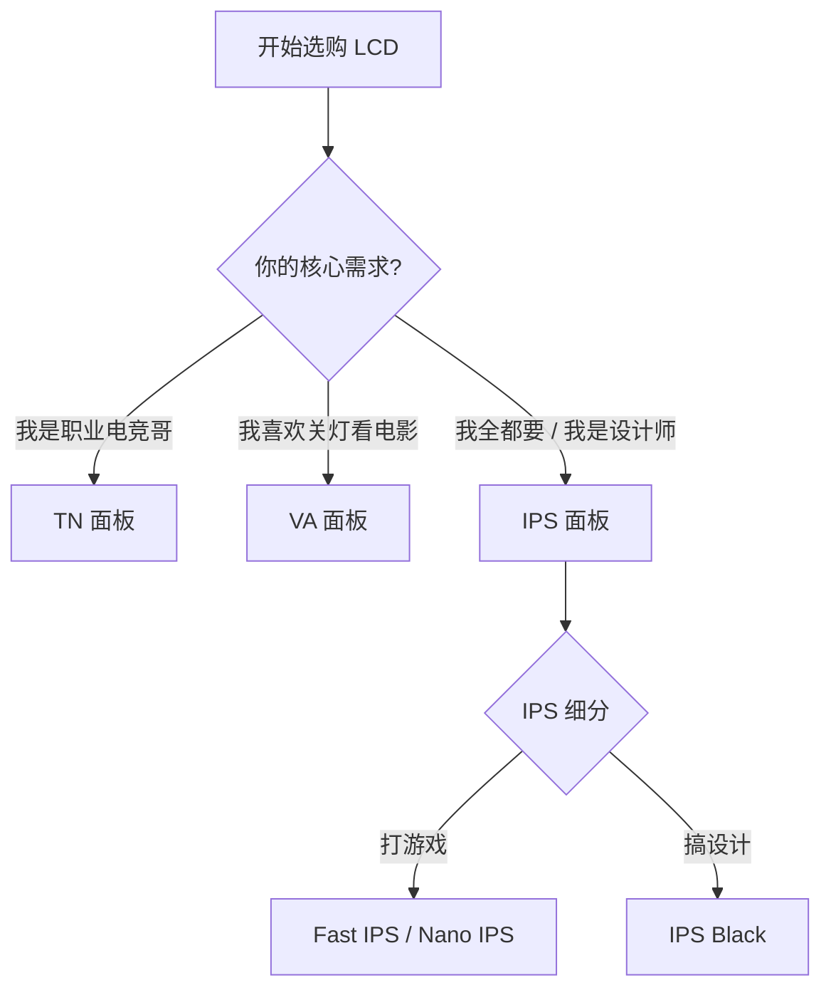

# 面板技术解析

如果把显示器比作一个舞台，那么**面板 (Panel)** 就是舞台的地板。无论剧本（色彩）多精彩，灯光（背光）多绚丽，如果地板本身质量不行，演出效果也会大打折扣。

目前的显示器市场呈现出“三足鼎立”的态势：老当益壮的 **LCD**，画质王者 **OLED**，以及新晋挑战者 **Mini-LED**。

---

## 1. LCD 家族: TN, VA, IPS

LCD (液晶显示器) 是目前最成熟、最普及的技术。它像一个三明治：中间是液晶层（控制光线通过），后面必须有一个**背光层**（提供光源）。根据液晶分子的排列方式，主要分为三类：

### TN (Twisted Nematic) —— 偏科的短跑运动员
*   **一句话总结**：为了速度牺牲了一切。
*   **优点**：**极速**。原生响应时间极快，刷新率极高（早期 360Hz+ 都是 TN）。
*   **缺点**：**泛白**。可视角度极差（稍微偏头就变色），色彩干瘪，对比度低。
*   **适用人群**：**职业 FPS 电竞选手** (CS:GO, Valorant)。除了这一类人，**强烈不推荐**普通用户购买。

### VA (Vertical Alignment) —— 适合关灯看电影
*   **一句话总结**：对比度高，但怕拖影。
*   **优点**：**黑得下去**。静态对比度高达 3000:1 - 4000:1，暗部细节丰富，漏光控制好。
*   **缺点**：**拖影 (Smearing)**。响应时间相对较慢，在暗色背景下移动物体容易出现“黑抹布”拖影。*注：三星高端 Odyssey 系列已解决此问题。*
*   **适用人群**：影音爱好者、单机大作玩家、曲面屏爱好者。

### IPS (In-Plane Switching) —— 全能的六边形战士
*   **一句话总结**：色彩准，视角广，最万金油。
*   **优点**：**色彩好**。色准高，色域广，可视角度无敌（178°）。
*   **缺点**：**对比度低**。通常只有 1000:1，暗室看黑色会发灰，且容易有**漏光**和**辉光 (IPS Glow)**。
*   **进化版**：
    *   **Fast IPS / Nano IPS**：解决了响应时间慢的问题，现在也能做到 1ms GtG，是电竞主流。
    *   **IPS Black**：将对比度提升至 2000:1，大幅改善了黑色表现。
*   **适用人群**：**绝大多数人**。无论是办公、设计还是游戏，IPS 都是最不容易出错的选择。

### 决策指南

---

## 2. OLED 技术: 像素级自发光

OLED (有机发光二极管) 不需要背光层，**每一个像素点都能自己发光**。这带来了革命性的画质提升。

### 核心优势
1.  **无限对比度**：像素可以完全关闭，显示出**纯粹的黑**。通透感极强。
2.  **极速响应**：< 0.03ms。比最快的 LCD 还要快 10 倍以上，动态清晰度无敌。
3.  **超薄**：像纸一样薄，甚至可以弯曲。

### 致命弱点
1.  **烧屏 (Burn-in)**：有机材料会老化。如果长时间显示固定的图标（如任务栏、血条），该区域会永久变暗，留下残影。
2.  **文字彩边**：由于特殊的子像素排列（如 WBGR 或 三角形排列），在 Windows 下渲染文字时，边缘可能会出现红绿色的虚边，导致文字不够锐利。

### 主流分支
*   **WOLED (LG)**：白光 OLED + 滤光片。技术成熟，适合电视。
*   **QD-OLED (Samsung)**：蓝光 OLED + 量子点。色彩更纯，色域更广，但抗光性稍弱（强光下黑色发紫）。

### 💡 防烧屏小贴士
*   设置**黑色壁纸**。
*   开启**自动隐藏任务栏**。
*   设置 5 分钟**自动息屏**。
*   不要把 OLED 当作长时间处理文档的生产力工具。

---

## 3. Mini-LED: LCD 的逆袭

Mini-LED 本质上**依然是 LCD**，但它把背光层换成了成千上万颗微小的 LED 灯珠，并把它们划分成几百上千个**独立控光分区**。

### 优势
*   **超高亮度**：轻松突破 1000 nits，甚至 2000 nits。阳光感十足，HDR 爆发力远超 OLED。
*   **不烧屏**：无机材料，寿命长，适合当主力生产力工具。

### 劣势：光晕效应 (Blooming)
当在纯黑背景上显示一个小亮点（如星空、鼠标指针）时，由于背光分区不够小，点亮的区域会溢出，导致亮点周围出现一圈灰白色的“光晕”。
*   **分区越多，光晕越弱**。推荐选购 **1152 分区**以上的产品。

---

## 4. 终极形态: Micro-LED

不要把它和 Mini-LED 搞混。
*   **Mini-LED** = LCD + 更好的背光。
*   **Micro-LED** = **自发光** (像 OLED)。

它将 LED 灯珠微缩到微米级别，直接作为像素点。它拥有 OLED 的一切优点（自发光、无限对比度、极速响应），同时拥有 LCD 的优点（无机材料、不烧屏、超高亮度）。

**现状**：技术太难，成本太高。目前仅用于百万元级的商用巨幕或 AR 眼镜。距离民用显示器普及还有很长的路要走。

---

## 本章小结

| 技术 | 核心优势 | 核心劣势 | 推荐场景 |
| :--- | :--- | :--- | :--- |
| **IPS (LCD)** | 色彩准、寿命长、便宜 | 对比度低、漏光 | 办公、设计、普通游戏 |
| **OLED** | **画质天花板**、响应极速 | **烧屏风险**、文字彩边 | 纯游戏、影音娱乐 |
| **Mini-LED** | **超高亮度**、不烧屏 | **光晕效应**、机身厚重 | HDR 视频剪辑、兼顾办公与娱乐 |
