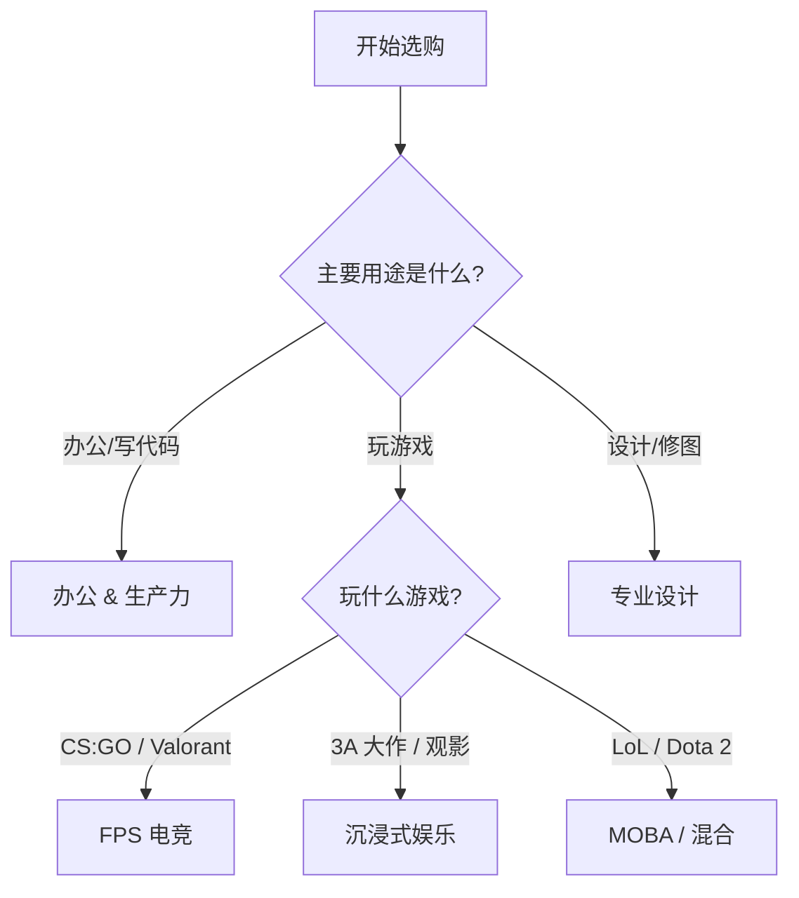

# 选购指南

参数是死的，需求是活的。没有完美的显示器，只有最适合你的显示器。

本章将根据你的**职业**和**使用场景**，提供简单粗暴的选购建议。

## 1. 快速决策流程图

如果不确定自己需要什么，请沿着这条路线走：

---

## 2. 办公与生产力 (Productivity)

对于打工人来说，屏幕是每天面对时间最长的“同事”。舒适度永远排在第一位。

### 程序员 / 文字工作者
*   **核心需求**：文字锐利，代码行数多，护眼。
*   **Mac 用户**：
    *   **首选**：**27寸 4K**。虽然不是完美的 2x Retina，但文字清晰度远超 2K。
    *   **土豪**：**27寸 5K** (Studio Display)。完美的视网膜体验。
    *   **避坑**：**27寸 2K**。字体发虚，锯齿明显。
    *   **💡 如何判断 HiDPI 支持？**
        *   **看分辨率**：**4K (3840x2160) 及以上**原生支持 HiDPI，无需担心。
        *   **看尺寸匹配**：24寸 4K / 27寸 5K 是“完美视网膜”；27寸 4K 是“主流视网膜”。
        *   **2K/1080p 怎么办？** macOS 原生不支持 2K 屏幕的 HiDPI，字体会发虚。
            *   *解决方案*：使用 **BetterDisplay** 或 **SwitchResX** 等软件强制开启 HiDPI（虚拟 4K 再缩放），但会占用少量 GPU 资源。
*   **Windows 用户**：
    *   **首选**：**27寸 2K**。Windows 的黄金分辨率，无需缩放，字号适中。
    *   **进阶**：**27寸 4K** (需开启 150% 缩放)。文字如印刷般清晰。
*   **必备功能**：**旋转升降支架** (竖屏写代码)、**硬件防蓝光**。

### 预算分级推荐 (参考价)
| 级别 | 预算 (CNY) | 典型配置 | 推荐理由 |
| :--- | :--- | :--- | :--- |
| **入门** | 800 - 1200 | 24"/27" 1080p/2K IPS | 满足基本显示，色彩尚可，护眼功能基础。 |
| **甜点** | 1500 - 2500 | 27" 4K IPS (Type-C 65W) | 细腻度提升巨大，一线通连接笔记本极其方便。 |
| **高端** | 4000+ | 27" 4K Nano IPS / 32" 4K | 更好的面板，更好的做工，甚至 Mini-LED 提升 HDR 效果。 |

---

## 3. 电竞与游戏 (Gaming)

### FPS 竞技 (CS:GO, Valorant)
*   **核心**：唯快不破。
*   **推荐**：**24.5寸 1080p + 360Hz (TN/Fast IPS)**。
*   **理由**：屏幕小一眼能看全，分辨率低保证显卡跑满超高帧，刷新率高保证极致流畅。

### MOBA / RTS 策略竞技 (LoL, Dota 2)
*   **核心**：视野广阔，全局掌控，色彩清晰。
*   **推荐**：**27寸 2K + 144Hz/165Hz (Fast IPS)**。
*   **理由**：
    *   2K 分辨率能在保证流畅的同时显示更多信息（小地图、技能栏）。
    *   Fast IPS 保证色彩准确，便于分辨复杂团战中的技能特效。
    *   144Hz 足够流畅，不需要像 FPS 那样追求 360Hz。
*   **进阶选择**：**34寸 21:9 带鱼屏**。在支持的游戏中能提供更宽的左右视野（物理外挂）。

### 3A 单机大作 (Cyberpunk 2077, 黑神话)
*   **核心**：沉浸感，画质。
*   **推荐**：**27寸/32寸 4K + 144Hz (OLED/Mini-LED)**。
*   **理由**：4K 带来的细腻度震撼远超高刷。HDR 能让光影效果逼真到起鸡皮疙瘩。

### 主机玩家 (PS5 / Xbox)
*   **核心**：适配次世代输出。
*   **推荐**：**4K 120Hz + HDMI 2.1**。
*   **电视 vs 显示器**：
    *   如果你有客厅沙发：买 **OLED 电视** (如 LG C系列)。大屏带来的震撼是显示器无法比拟的。
    *   如果你只能在书桌玩：买 **4K 144Hz 显示器**。

### 预算分级推荐 (参考价)
| 级别 | 预算 (CNY) | 典型配置 | 推荐理由 |
| :--- | :--- | :--- | :--- |
| **入门** | 800 - 1200 | 24" 1080p 144Hz IPS | 体验高刷的门槛，适合学生党。 |
| **甜点** | 1500 - 2500 | 27" 2K 165Hz Fast IPS | 目前最主流的全能配置，兼顾画质与流畅度。 |
| **发烧** | 5000+ | 27"/32" 4K OLED / Mini-LED | 极致的 HDR 体验，黑得下去，亮得起来。 |

---

## 4. 专业设计 (Creative)

### 设计师 / 摄影师
*   **核心需求**：色准，色域，均匀度。
*   **UI / Web 设计**：**99% sRGB**。因为你的作品最终是在普通用户的 sRGB 屏幕上展示的。
*   **平面 / 印刷**：**99% Adobe RGB**。
*   **视频剪辑**：**21:9 带鱼屏**。超长的时间轴能显著提升效率。

---

## 5. 常见误区 (Myths)：别交智商税

### ❌ 误区 1：“对比度 5000万:1”
*   **真相**：这是**动态对比度**，毫无意义。
*   **正解**：只看**静态对比度**。IPS 1000:1，VA 3000:1。

### ❌ 误区 2：“1ms 响应时间”
*   **真相**：如果是 LCD 屏幕，这通常是 **MPRT** 数据，开启后屏幕变暗且不能用 G-Sync。
*   **正解**：只看 **GtG** 响应时间。

### ❌ 误区 3：“支持 HDR”
*   **真相**：几百块的 **HDR 400** 显示器，开启 HDR 后画面发灰泛白，效果不如不开。
*   **正解**：没钱买 HDR 600/1000，就老老实实当 SDR 显示器用。

### ❌ 误区 4：“曲面屏更高级”
*   **真相**：对于 16:9 的小尺寸 (27寸以下) 屏幕，曲面不仅没必要，还会导致直线看起来是弯的（特别是画图时）。
*   **正解**：只有 **34寸以上带鱼屏** 或 **超大尺寸 VA 屏** 才需要曲面。

### ❌ 误区 5：“原生 10-bit”
*   **真相**：市面上 99% 的 10-bit 都是 **8-bit + FRC**。
*   **正解**：别纠结，肉眼看不出来的。

---

## 6. 购前检查清单 (Checklist)

在下单前，请最后确认一遍：

- [ ] **桌子深度**：如果买 32 寸，桌深建议 > 70cm，否则看久了脖子疼。
- [ ] **显卡接口**：确认显卡有 DP 1.4 或 HDMI 2.1 接口，否则跑不满 4K 144Hz。
- [ ] **线材**：尽量使用显示器自带的原装线，或者购买通过 VESA 认证的线材。
- [ ] **坏点政策**：询问客服“几个坏点包换？”，有些品牌规定 3 个以内算正常，不给退换。
- [ ] **Mac 兼容性**：如果是 Mac 用户，确认显示器是否支持 HiDPI 缩放，以及 Type-C 接口是否支持反向充电（至少 65W，建议 90W）。

---

## 终极汇总表

| 你的身份 | 推荐尺寸 | 推荐分辨率 | 面板首选 | 关键特性 |
| :--- | :--- | :--- | :--- | :--- |
| **Mac 办公** | 27" | **4K / 5K** | IPS | HiDPI, USB-C 一线通 |
| **Win 办公** | 27" | **2K** | IPS | 硬件防蓝光, 升降支架 |
| **FPS 职业哥** | 24.5" | **1080p** | TN / Fast IPS | 360Hz+, DyAc |
| **MOBA 玩家** | 27" / 34" | **2K / WQHD** | Fast IPS | 144Hz, 广色域 |
| **3A 画面党** | 32" | **4K** | **OLED / Mini-LED** | HDR 1000, G-Sync |
| **主机玩家** | 32" / 55"+ | **4K** | OLED (电视) | HDMI 2.1, VRR |
