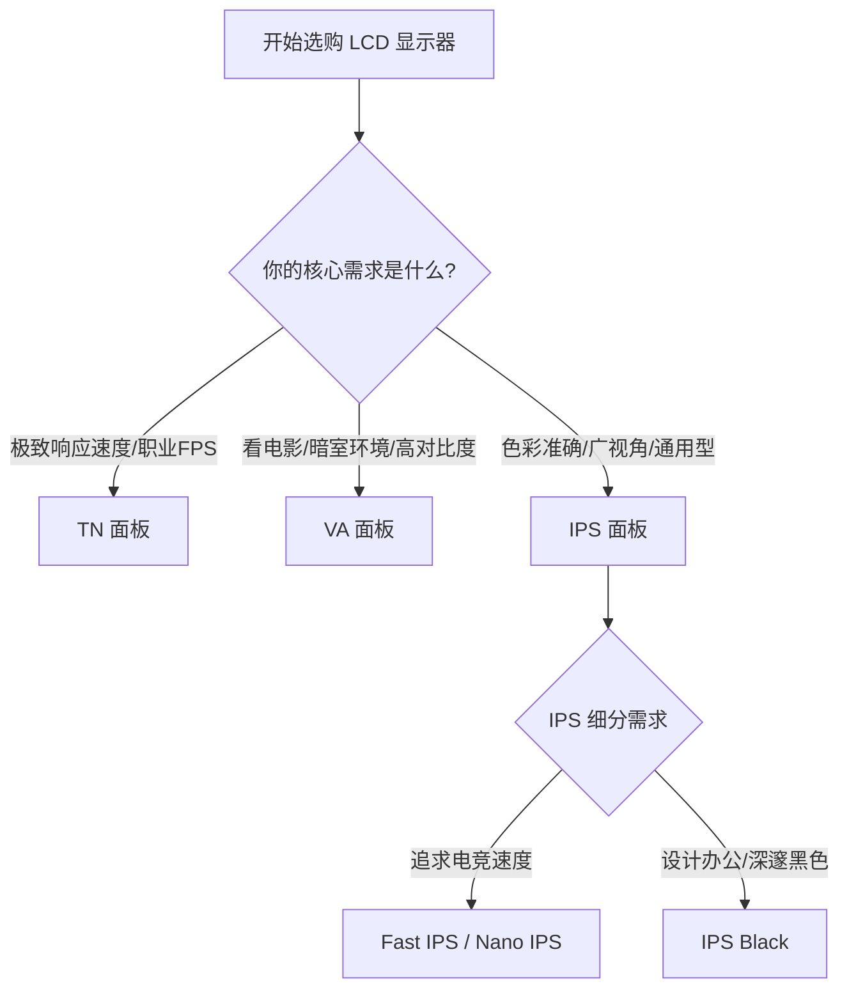

# LCD 家族: TN, VA, IPS

液晶显示器 (LCD) 需要背光层发光，液晶层控制光线通过。根据液晶排列方式不同，主要分为三大类。

## 1. TN (Twisted Nematic)
*   **关键词**：**极速**、**泛白**。
*   **优点**：
    *   响应时间极快（原生可达 1ms 以下）。
    *   刷新率极高（早期的 240Hz+ 都是 TN）。
    *   成本低廉。
*   **缺点**：
    *   **可视角度极差**：稍微偏一点看就变色。
    *   **色彩表现差**：对比度低，颜色泛白，覆盖色域窄。
*   **适用人群**：职业 FPS 电竞选手（CS:GO, Valorant）。普通玩家不推荐。

## 2. VA (Vertical Alignment)
*   **关键词**：**高对比度**、**曲面**、**拖影**。
*   **优点**：
    *   **对比度高**：静态对比度通常在 3000:1 以上，黑色深邃，适合看电影。
    *   **漏光控制好**：不像 IPS 容易漏光。
    *   **容易做成曲面**。
*   **缺点**：
    *   **响应时间慢**：这是致命伤，容易产生“黑抹布”效应（暗部场景移动时的严重拖影）。*注：三星高端 Odyssey 系列使用的 Fast VA 技术已基本解决此问题。*
    *   **可视角度一般**：侧看会泛白（Gamma Shift）。
*   **适用人群**：影音爱好者、单机大作玩家、习惯曲面屏的用户。

## 3. IPS (In-Plane Switching)
*   **关键词**：**色彩准**、**可视角度好**、**漏光**。
*   **优点**：
    *   **色彩表现最佳**：色准高，色域广。
    *   **可视角度优秀**：任意角度看都不偏色。
    *   **响应速度均衡**：现在的 Fast IPS / Nano IPS 响应时间已能做到 1ms GtG，仅仅略逊于 TN。
*   **缺点**：
    *   **对比度低**：通常只有 1000:1，黑色不够黑，暗室观看显得发灰。
    *   **IPS Glow**：黑色背景下的辉光现象。
    *   **漏光**：品控不好的屏幕边缘会有漏光。
*   **适用人群**：设计师、摄影师、绝大多数游戏玩家、办公用户。**IPS 是目前最万金油的选择**。

### IPS 的子分类
*   **Fast IPS / Rapid IPS**：友达光电等厂商推出，显著提升了响应速度，适合电竞。
*   **Nano IPS**：LG 推出，在背光层加入纳米粒子吸收多余光波，色域极广（DCI-P3 98%），但对比度略低（800:1 左右）。
*   **IPS Black**：LG 最新技术，将对比度提升至 2000:1，大幅改善了黑色表现。

## 面板选择决策图

## 总结对比表

| 特性 | TN | VA | IPS |
| :--- | :--- | :--- | :--- |
| **响应速度** | ⭐⭐⭐⭐⭐ | ⭐⭐ | ⭐⭐⭐⭐ |
| **可视角度** | ⭐ | ⭐⭐⭐ | ⭐⭐⭐⭐⭐ |
| **色彩表现** | ⭐⭐ | ⭐⭐⭐⭐ | ⭐⭐⭐⭐⭐ |
| **对比度** | ⭐⭐ | ⭐⭐⭐⭐⭐ | ⭐⭐⭐ |
| **推荐用途** | 职业电竞 | 影音、单机游戏 | 设计、通用电竞、办公 |
